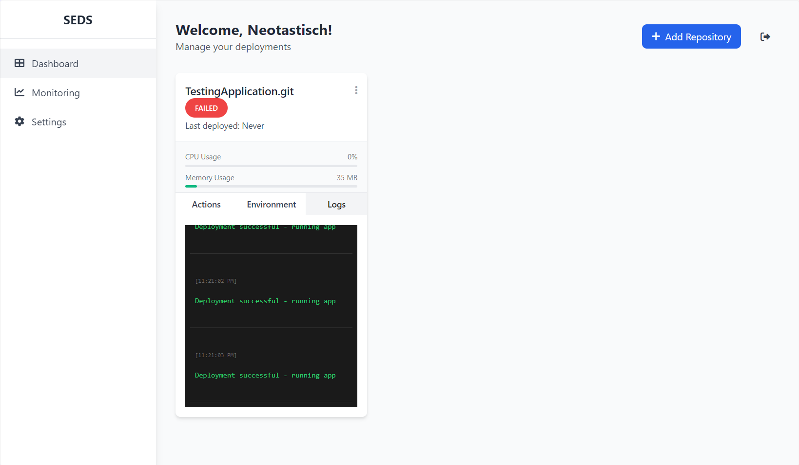
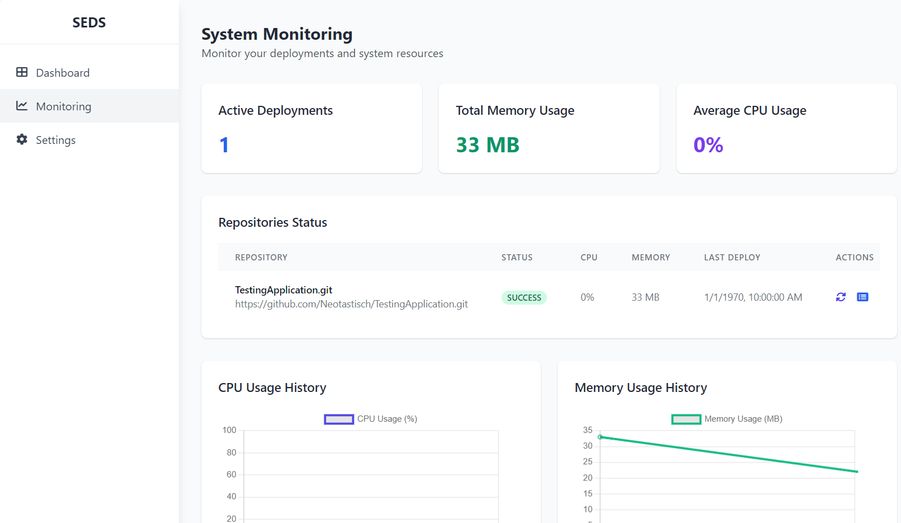

# SEDS - Super Easy Deploy System

### Note: This is a work in progress and is not yet ready for production use.

A simple GitHub-based deployment system that allows users to easily deploy their projects with one click.



## Features

- GitHub OAuth authentication
- Support for both public and private repositories 
- Automatic deployment on repository updates with secure webhooks using Docker
- Environment variable management
- Real-time process monitoring (CPU, Memory usage)
- Support for multiple project types:
  - Node.js projects
  - Python projects
  - Java Maven projects
  - Java Gradle projects
  - Go projects
- Intelligent port management and routing
- Deployment logs with color-coded output
- Easy-to-use web interface
- Repository status monitoring
- Automatic project type detection



## Prerequisites

- Node.js (v14 or higher)
- SQLite3
- Git
- Docker

## Installation

1. Clone the repository

2. Install dependencies:
```bash
npm install
```

3. Create a `.env` file in the root directory with the following content:
```env
GITHUB_CLIENT_ID=your_github_client_id
GITHUB_CLIENT_SECRET=your_github_client_secret
GITHUB_CALLBACK_URL=http://localhost:3000/auth/github/callback
GITHUB_WEBHOOK_SECRET=your_webhook_secret_here
APP_URL=http://localhost:3000
```

To generate a secure webhook secret, you can use:
```bash
node -e "console.log(require('crypto').randomBytes(32).toString('hex'))"
```

4. Create the `deployments` directory:
```bash
mkdir -p src/deployments
```

5. Start the server:
```bash
npm start
```

The application will be available at `http://localhost:3000`.

## Usage

1. Visit the application URL and log in with your GitHub account.
2. Click "Add Repository" to add a new repository for deployment.
3. Enter the repository URL and submit.
4. Configure environment variables if needed.
5. The system will:
   - Automatically detect the project type
   - Set up secure webhooks for automatic deployment
   - Assign an available port
   - Start the application
   - Begin monitoring resources

### Port Management

The system automatically manages ports for your applications:
- Each application gets a unique internal port
- Port conflicts are automatically resolved
- Applications can be accessed through their assigned ports
- Port information is available through the API

### Automatic Deployments

When changes are pushed to your repository:
1. GitHub sends a secure webhook to your application
2. The webhook signature is verified
3. Latest changes are pulled from the repository
4. The application is automatically redeployed
5. Environment variables are updated
6. Process monitoring is restarted

## Project Structure

```
src/
  ├── index.js           # Main application file
  ├── routes/            # Route handlers
  │   ├── repository.js  # Repository management routes
  │   └── monitoring.js  # Monitoring routes
  ├── services/          # Business logic
  │   └── deployment.js  # Deployment service
  ├── views/             # EJS templates
  │   ├── index.ejs     # Landing page
  │   ├── login.ejs     # Login page
  │   ├── dashboard.ejs # Main dashboard
  │   └── monitoring.ejs# Monitoring page
  └── deployments/       # Directory for deployed projects
```

## Development

To run the application in development mode with auto-reload:

```bash
npm run dev
```

## Security Considerations

- GitHub OAuth authentication
- Secure webhook signatures using SHA-256
- Environment variables stored securely in SQLite
- Process isolation with separate environments
- Access control based on user authentication
- Secure port management
- Webhook secret verification

## Monitoring Features

- Real-time CPU usage tracking
- Memory usage monitoring
- Process status tracking
- Color-coded deployment logs
- Automatic log rotation
- Resource usage graphs
- System-wide statistics

## Limitations

- Basic process management (no containerization)
- Local SQLite database (not suitable for production)
- Limited to single-server deployments
- No load balancing

## Future Improvements

- Multiple deployment environments
- Advanced logging and monitoring
- Custom domain support
- Horizontal scaling capabilities
- Database migration system
- Load balancing
- SSL/TLS support
- Custom deployment scripts
- Backup and restore functionality 